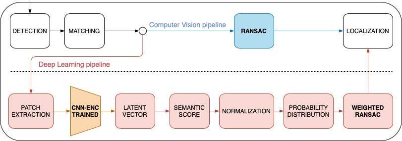
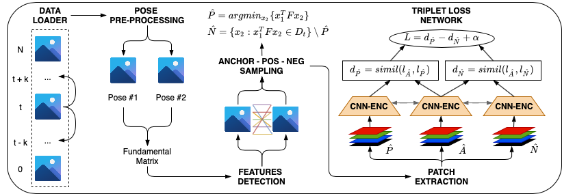
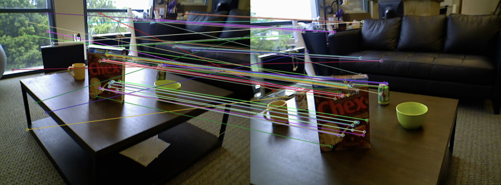
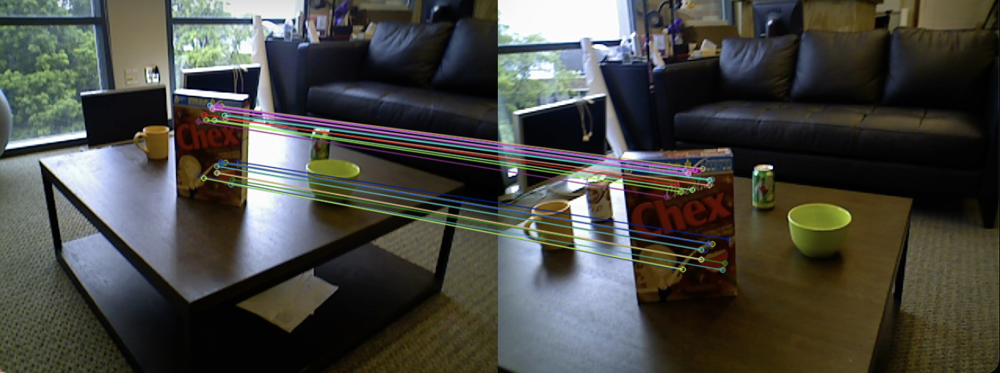

# Semantic Sampling Localization: RGB-D Patch-Based Triplet Network
Image Analysis and Computer Vision course project 2021-2022, Politecnico di Milano.

This work analyses the Localization task of RGB-D images using a Deep Neural Network (DNN) tuned to improve the baseline performance of RANSAC by exploiting visual semantic information. We propose a DNN able to extract a semantic sampling distribution from paired key points to improve the Mean Average Accuracy (mAA), chosen as a reference metric. Next, the importance of the depth channel is shown by comparing the same DNN trained on RGB or RGB-D. Finally, Point Clouds are generated from paired images of the same scene, and Registration is performed to visualize the results in 3D space through the depth information.

## Pipeline

The proposed methodology has been conceived for the purpose of improving the RANSAC baseline by taking into account the visual paired-semantic information of two images referring to the same scene; as a result, a weighted sampling distribution is produced to build up the model.
While the standard Localization approach straightforwardly takes place by applying RANSAC right after the detection-matching computation, our technique is structured as follows

## Triplet Training

## Results
- With classical RANSAC:

- With our DNN-based proposed approach: 

